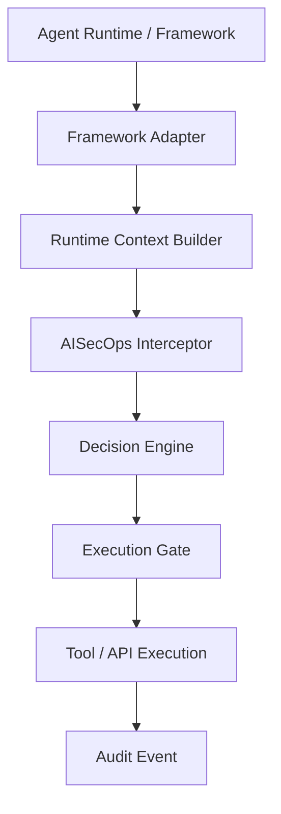
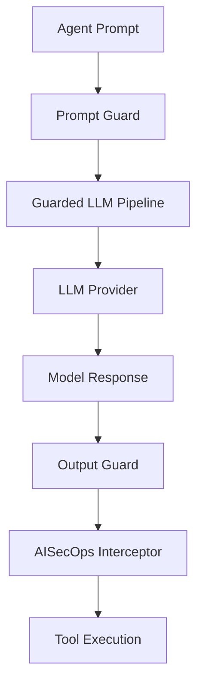
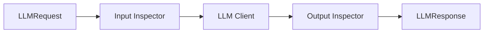
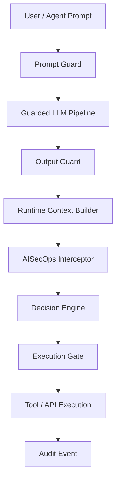
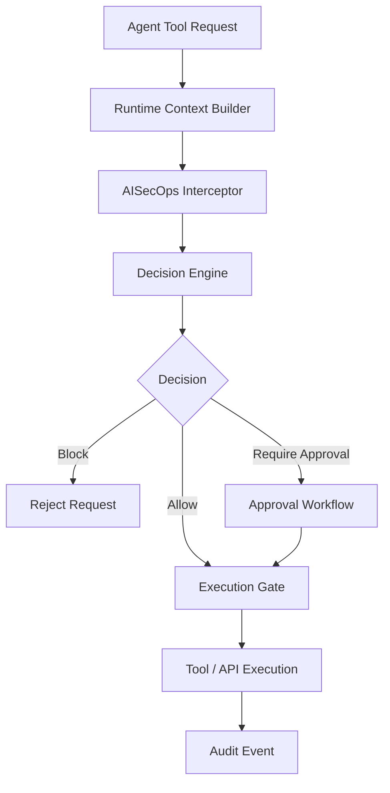
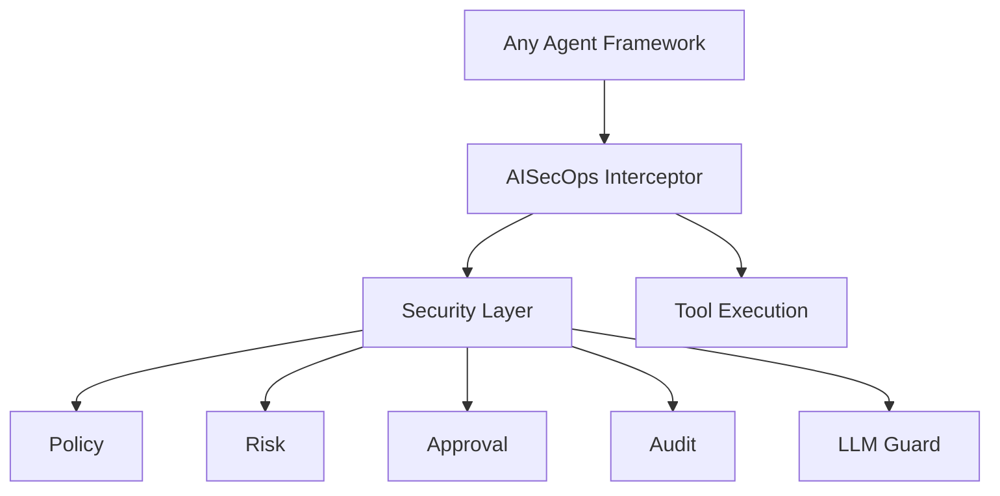

# AISecOps Interceptor

Runtime security and policy enforcement for AI agents.

AISecOps Interceptor is a **framework‑agnostic runtime security layer** that sits between an AI agent runtime and the tools, APIs, or actions it wants to execute.

The project has evolved from an early proof‑of‑concept into the **core of a portable AI security runtime** designed to work with multiple agent frameworks such as OpenClaw, LangGraph, CrewAI, or custom agent systems.

---

# What the interceptor provides

AISecOps Interceptor enforces security and policy at **two critical layers of agentic AI systems**:

1. **Prompt layer protection** (before a large language model (LLM) is called)
2. **Tool execution protection** (before a tool or API is executed)

This ensures:

- prompt injection protection
- secret exfiltration protection
- policy‑based tool execution
- human approval for sensitive actions
- full audit trail

---

# Included capabilities

Current implementation includes:

### Core runtime

- Interceptor core
- Runtime context propagation
- Policy evaluation
- Optional declarative rule engine
- YAML policy bundles with validation
- Decision engine + execution gate
- Human approval workflow
- Structured runtime event logging with JSONL persistence
- Optional multi-sink runtime event emission

### LLM security layer

- Provider‑agnostic LLM abstraction
- Guarded LLM pipeline
- Prompt inspection
- Output inspection

### Supported model providers

- OpenAI
- Ollama (local models)
- Anthropic (Claude)

### Integrations

- LangGraph‑style adapter
- OpenClaw‑style adapter
- Generic adapter example

### Developer tooling

- FastAPI runtime wrapper
- Demo scripts (`agent_demo`, `demo.py`, `langgraph_style_demo`, `openclaw_demo`)
- Full pytest test suite

---

# High‑level architecture



Adapters are intentionally **thin**.

All security logic lives inside the interceptor core.

---

# LLM security architecture

The interceptor now includes a **guarded LLM pipeline**.

This protects both prompt input and model output before tools are executed.



---

# Guarded LLM pipeline

The pipeline ensures every LLM request follows this path:



`GuardedLLMPipeline.chat(...)` can optionally accept a `RuntimeContext` and propagate it through LLM guard checks.
It can also emit structured LLM-stage security events (`prompt_allowed`, `prompt_blocked`, `output_allowed`, `output_blocked`) through the same runtime event model used by tool execution and audit logging.
`RuntimeContext` also carries optional source and sensitivity metadata (`source`, `data_classification`, `sensitivity_level`) for downstream security workflows and policy decisions.

Runtime events can be persisted to JSONL and retrieved through the API for downstream analysis or audit review.
The `/audit` endpoint supports optional query parameters: `event_type`, `stage`, `agent_name`, `tool_name`, `correlation_id`, and `limit`.
`AuditLogger` can also emit the same `RuntimeEvent` records to multiple sinks, such as JSONL persistence and additional in-memory or external streaming adapters.
Supported sink types include file-backed JSONL persistence, in-memory collection, and webhook delivery to external HTTP endpoints.
Sink delivery is isolated per sink, so one failing sink does not block the others.

Security violations raise:

```
LLMGuardViolationError
```

Which prevents unsafe model responses from reaching the agent runtime.

---

# Supported LLM providers

All providers implement the same interface:

```
LLMClient
   └── chat(LLMRequest) → LLMResponse
```

Providers included:

```
ollama_client.py
openai_client.py
anthropic_client.py
```

The factory creates providers dynamically:

```
create_llm_client(LLMConfig)
```

---

# Rule-based policy

`PolicyEngine` can evaluate an ordered set of declarative rules before falling back to the existing config-driven checks.

Each rule supports:

- `tool_name`
- `agent_name` (optional)
- `sensitivity_level` (optional)
- `action`: `allow`, `block`, or `require_approval`

If rules are provided, the first matching rule wins and overrides the default policy behavior. If no rule matches, the existing blocked-tool, dangerous-argument, allowlist, approval, and monitored-tool logic still applies. The current test suite covers allow, block, require-approval, and sensitivity-based rule evaluation.

Example:

```python
policy = PolicyEngine(
    {
        "rules": [
            {"tool_name": "restart_service", "agent_name": "ops_agent", "action": "require_approval"},
            {"tool_name": "read_customer", "sensitivity_level": "high", "action": "block"},
        ]
    }
)
```

---

# Policy bundles

Declarative rules can also be loaded from YAML bundles instead of Python dictionaries.

Example bundle:

```yaml
rules:
  - tool_name: restart_service
    agent_name: ops_agent
    action: require_approval

  - tool_name: read_customer
    sensitivity_level: high
    action: block
```

Supported rule fields:

- `tool_name` (required)
- `action` (required): `allow`, `block`, or `require_approval`
- `agent_name` (optional)
- `sensitivity_level` (optional)

Load a bundle with:

```python
policy = PolicyEngine.from_yaml("policies/production.yaml")
```

YAML bundles are validated before rules are constructed, and invalid bundles raise a validation error.

---

# Repository structure

```text
aisecops_interceptor/

  api/
    main.py

  core/
    interceptor.py
    policy.py
    approval.py
    audit.py
    context.py
    decision.py
    execution.py
    events.py

  guard/
    detectors.py
    input_inspector.py
    output_inspector.py
    models.py

  llm/
    base.py
    config.py
    factory.py
    models.py
    pipeline.py

    providers/
      ollama_client.py
      openai_client.py
      anthropic_client.py

  policy/
    rules.py
    rule_engine.py
    schema.py
    loader.py

  integrations/
    langgraph_adapter.py
    openclaw_adapter.py
    simple_adapter.py

examples/

  agent_demo.py
  demo.py
  langgraph_style_demo.py
  openclaw_demo.py
  policy_bundle_demo.py

tests/
  test_policy_engine.py
  test_policy_loader.py
```

---


# Full AISecOps security pipeline

This diagram shows the **complete runtime security flow** from prompt to tool execution.



This makes it clear that **both prompt-layer threats and tool-execution risks are governed by the AISecOps runtime**.

# Example runtime flow



This diagram shows the **tool-execution governance path** after prompt and output checks have already completed.
Policy decisions in this flow may come from declarative rules or from the fallback config-driven policy logic.

---

# Quick start

```bash
# create environment
python3.13 -m venv .venv
source .venv/bin/activate

# install dependencies
pip install -r requirements.txt

# run tests
pytest -q

# run API
uvicorn aisecops_interceptor.api.main:app --reload

# run demos
python -m examples.agent_demo
python examples/demo.py
python -m examples.langgraph_style_demo
python examples/openclaw_demo.py
python -m examples.policy_bundle_demo
```

---

# Test coverage

Current tests validate:

- prompt injection detection
- secret detection in model output
- guarded LLM pipeline behavior
- declarative rule-based policy evaluation
- YAML policy bundle loading and validation
- provider factory behavior
- interceptor decisions and approval flow
- runtime context and execution gate behavior
- adapter and API route coverage

Example test output:

```
All tests passing
```

---

# Example approval workflow

1. Agent calls sensitive tool
2. Policy requires approval
3. Interceptor creates approval ID
4. Human approves request
5. Tool execution proceeds

---

# Long‑term vision

AISecOps Interceptor is intended to become a **universal security runtime for AI agents**.

Goal architecture:



Frameworks like:

- OpenClaw
- LangGraph
- CrewAI
- AutoGen

should all plug into the same interceptor runtime.

---

# Project direction

AISecOps Interceptor is the **core product**.

Agent frameworks are **integration surfaces**, not the center of the architecture.

The objective is a portable runtime capable of securing:

- AI copilots
- autonomous agents
- enterprise AI systems
- AI developer platforms

---

# Status

Current state:

Working runtime core + guarded LLM pipeline + interceptor enforcement + declarative rule engine + end-to-end demo coverage.

Current engineering focus:

- expand declarative policy coverage while keeping fallback policy behavior simple
- strengthen policy evaluation with richer runtime metadata
- improve audit and event visibility across prompt and tool execution stages
- keep adapters thin while improving real framework integrations

---
