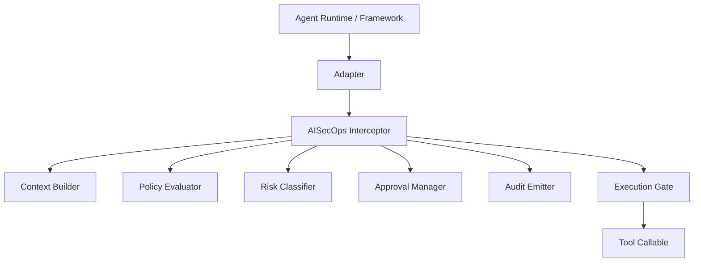
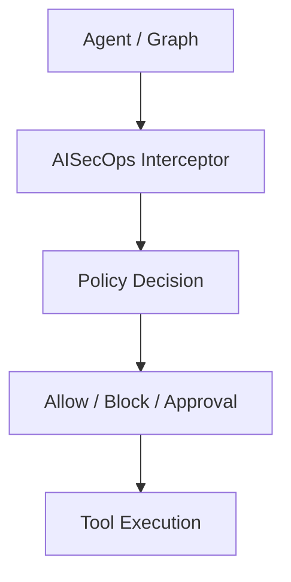
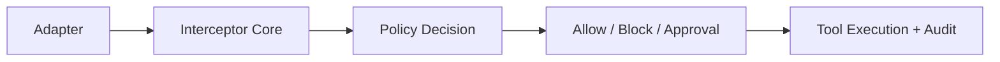
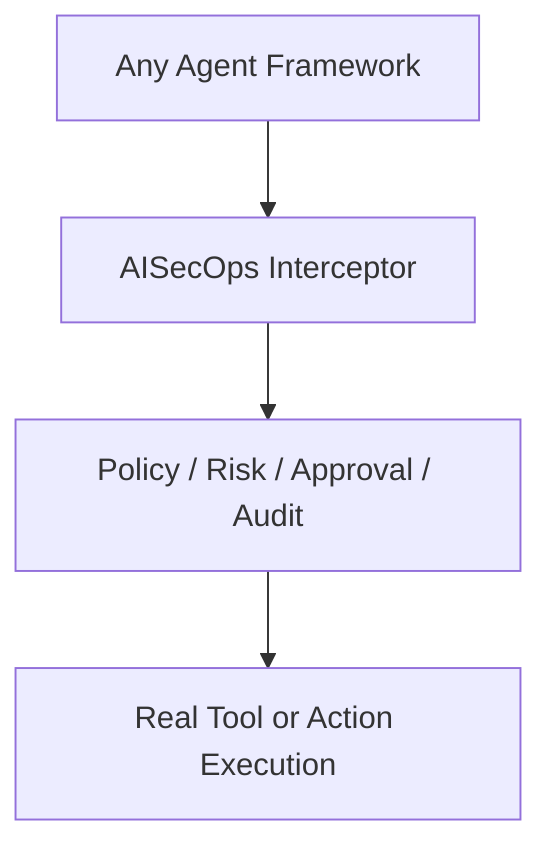

# AISecOps Interceptor

Runtime security and policy enforcement for AI agents.

AISecOps Interceptor is a framework-agnostic runtime enforcement layer that sits between an AI agent runtime and the tools, APIs, and actions it wants to execute.

The current codebase is beyond the original proof-of-concept stage and should now be treated as the beginning of the real product core: a portable interceptor with thin framework adapters.

## Included now

- Core interception before tool execution
- Policy-based allow / block / approval decisions
- Structured audit logging
- Risk levels (`low`, `medium`, `high`)
- Human approval workflow for sensitive actions
- FastAPI wrapper for local API testing
- LangGraph-style adapter
- OpenClaw-style adapter
- Demos and tests

## Architecture

The product architecture is now centered on a framework-agnostic interception core.

Adapters should remain thin and translate framework-specific tool calls into a common AISecOps execution contract.

The core flow is:



Design rule:

- framework integrations do not contain security policy logic
- policy, risk, approval, and audit stay in the interceptor core
- the API layer is only a wrapper for testing and local development

## Quick start

```bash
# Create environment
python3.13 -m venv .venv
source .venv/bin/activate

# Install dependencies
pip install -r requirements.txt

# Run tests
pytest -q

# Start interceptor API
uvicorn aisecops_interceptor.api.main:app --reload

# Run base demo
python examples/demo.py

# Run LangGraph-style interceptor demo (recommended first)
python -m examples.langgraph_style_demo

# Run OpenClaw-style tool execution demo
python examples/openclaw_demo.py
```

Use Python 3.11 through 3.13 for this project. Python 3.14 currently fails while building `pydantic-core`, which is required by the pinned `pydantic` dependency.

## Key files

```text
aisecops_interceptor/
  api/
    main.py
  config/
    policies.yaml
  core/
    approval.py
    audit.py
    exceptions.py
    interceptor.py
    models.py
    policy.py
  integrations/
    langgraph_adapter.py
    openclaw_adapter.py
    simple_adapter.py
examples/
  demo.py
  langgraph_style_demo.py
  openclaw_demo.py
tests/
```

## Example approval flow

1. Agent requests `restart_service`
2. Policy marks it `approval_required`
3. Interceptor creates `approval_id`
4. Human approves
5. Same call is replayed with `approval_id`
6. Tool executes

## Validated runtime behaviors

The current demos validate the three core AISecOps control paths:

| Scenario | Result |
|--------|--------|
| Safe tool call | Executes immediately |
| Restricted tool call | Blocked by policy |
| Sensitive tool call | Requires human approval |

Example LangGraph demo output:

```
1) Safe tool call
{'service': 'payments', 'status': 'green'}

2) Approval-required tool call
{'approval_required': True, 'approval_id': 'apr-xxxx', 'message': "Tool 'restart_service' requires human approval"}

3) Re-run after approval
{'service': 'payments', 'status': 'restarted'}
```

This confirms the runtime control model:



This validates the current product shape:



## FastAPI endpoints

- `POST /execute`
- `GET /audit`
- `GET /approvals`
- `POST /approvals/{approval_id}/approve`
- `POST /approvals/{approval_id}/reject`
- `POST /openclaw/execute`

## Strategic next code changes

The next phase is to turn the current working starter into a cleaner product core.

Immediate priorities:

- define a stable interceptor execution contract for all adapters
- formalize runtime context passed into the interceptor
- separate decision phase from execution phase
- keep adapters thin and free of policy logic
- enrich audit events into a real security telemetry model
- make approval state first-class and extensible

Near-term follow-up:

- add a formal adapter base interface
- add persistent approval and audit storage
- add policy provider abstraction beyond YAML
- add native runtime integrations for real LangGraph and OpenClaw execution paths

## Product direction

AISecOps Interceptor is the product core.

OpenClaw, LangGraph, CrewAI, and other agent frameworks should be treated as integration surfaces, not as the center of the architecture.

The long-term goal is a portable runtime control layer for AI agents:


