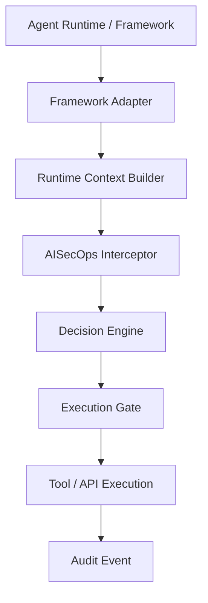
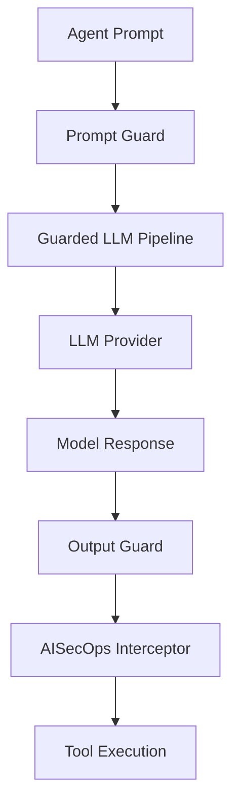
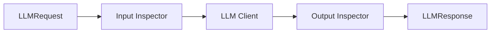
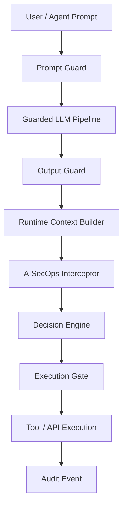
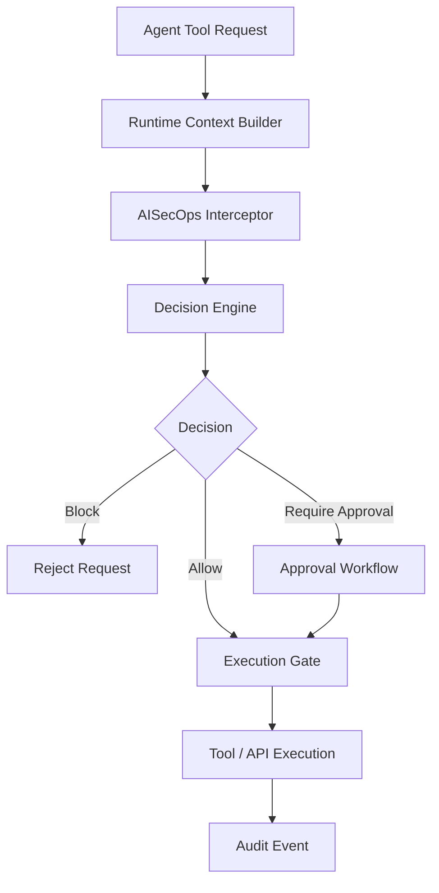
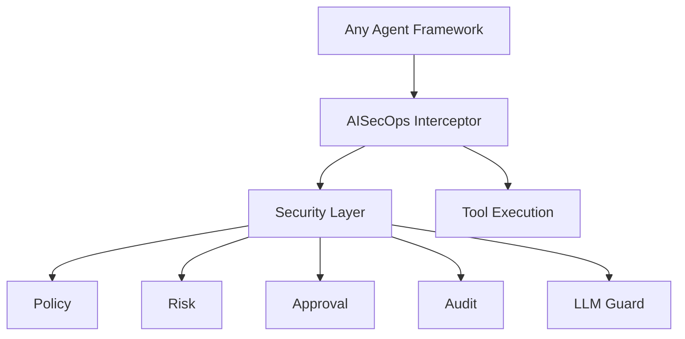

# AISecOps Interceptor

Runtime security and policy enforcement for AI agents.

AISecOps Interceptor is a **framework‑agnostic runtime security layer** that sits between an AI agent runtime and the tools, APIs, or actions it wants to execute.

The project has evolved from an early proof‑of‑concept into the **core of a portable AI security runtime** designed to work with multiple agent frameworks such as OpenClaw, LangGraph, CrewAI, or custom agent systems.

---

# What the interceptor provides

AISecOps Interceptor enforces security and policy at **two critical layers of AI systems**:

1. **Prompt layer protection** (before an LLM is called)
2. **Tool execution protection** (before a tool or API is executed)

This ensures:

- prompt injection protection
- secret exfiltration protection
- policy‑based tool execution
- human approval for sensitive actions
- full audit trail

---

# Included capabilities

Current implementation includes:

### Core runtime

- Interceptor core
- Policy evaluation
- Risk classification
- Human approval workflow
- Structured audit logging

### LLM security layer

- Provider‑agnostic LLM abstraction
- Guarded LLM pipeline
- Prompt inspection
- Output inspection

### Supported model providers

- OpenAI
- Ollama (local models)
- Anthropic (Claude)

### Integrations

- LangGraph‑style adapter
- OpenClaw‑style adapter
- Generic adapter example

### Developer tooling

- FastAPI runtime wrapper
- Demo scripts
- Full pytest test suite

---

# High‑level architecture



Adapters are intentionally **thin**.

All security logic lives inside the interceptor core.

---

# LLM security architecture

The interceptor now includes a **guarded LLM pipeline**.

This protects both prompt input and model output before tools are executed.



---

# Guarded LLM pipeline

The pipeline ensures every LLM request follows this path:



Security violations raise:

```
LLMGuardViolationError
```

Which prevents unsafe model responses from reaching the agent runtime.

---

# Supported LLM providers

All providers implement the same interface:

```
LLMClient
   └── chat(LLMRequest) → LLMResponse
```

Providers included:

```
ollama_client.py
openai_client.py
anthropic_client.py
```

The factory creates providers dynamically:

```
create_llm_client(LLMConfig)
```

---

# Repository structure

```text
aisecops_interceptor/

  api/
    main.py

  core/
    interceptor.py
    policy.py
    approval.py
    audit.py
    context.py
    decision.py
    execution.py
    events.py

  guard/
    detectors.py
    input_inspector.py
    output_inspector.py
    models.py

  llm/
    base.py
    config.py
    factory.py
    models.py
    pipeline.py

    providers/
      ollama_client.py
      openai_client.py
      anthropic_client.py

  integrations/
    langgraph_adapter.py
    openclaw_adapter.py
    simple_adapter.py

examples/

  demo.py
  langgraph_style_demo.py
  openclaw_demo.py

tests/
```

---


# Full AISecOps security pipeline

This diagram shows the **complete runtime security flow** from prompt to tool execution.



This makes it clear that **both prompt-layer threats and tool-execution risks are governed by the AISecOps runtime**.

# Example runtime flow



This architecture ensures both **prompt‑layer attacks** and **dangerous tool executions** are controlled.

---

# Quick start

```bash
# create environment
python3.13 -m venv .venv
source .venv/bin/activate

# install dependencies
pip install -r requirements.txt

# run tests
pytest -q

# run API
uvicorn aisecops_interceptor.api.main:app --reload

# run demos
python examples/demo.py
python -m examples.langgraph_style_demo
python examples/openclaw_demo.py
```

---

# Test coverage

Current tests validate:

- prompt injection detection
- secret detection in model output
- guarded LLM pipeline behavior
- provider factory

Example test output:

```
19 passed
```

---

# Example approval workflow

1. Agent calls sensitive tool
2. Policy requires approval
3. Interceptor creates approval ID
4. Human approves request
5. Tool execution proceeds

---

# Long‑term vision

AISecOps Interceptor is intended to become a **universal security runtime for AI agents**.

Goal architecture:



Frameworks like:

- OpenClaw
- LangGraph
- CrewAI
- AutoGen

should all plug into the same interceptor runtime.

---

# Project direction

AISecOps Interceptor is the **core product**.

Agent frameworks are **integration surfaces**, not the center of the architecture.

The objective is a portable runtime capable of securing:

- AI copilots
- autonomous agents
- enterprise AI systems
- AI developer platforms

---

# Status

Current state:

Working runtime core + guarded LLM pipeline + interceptor enforcement.

Next steps will focus on:

- richer policy engine
- persistent audit storage
- advanced prompt attack detection
- native integrations for real agent frameworks

---
