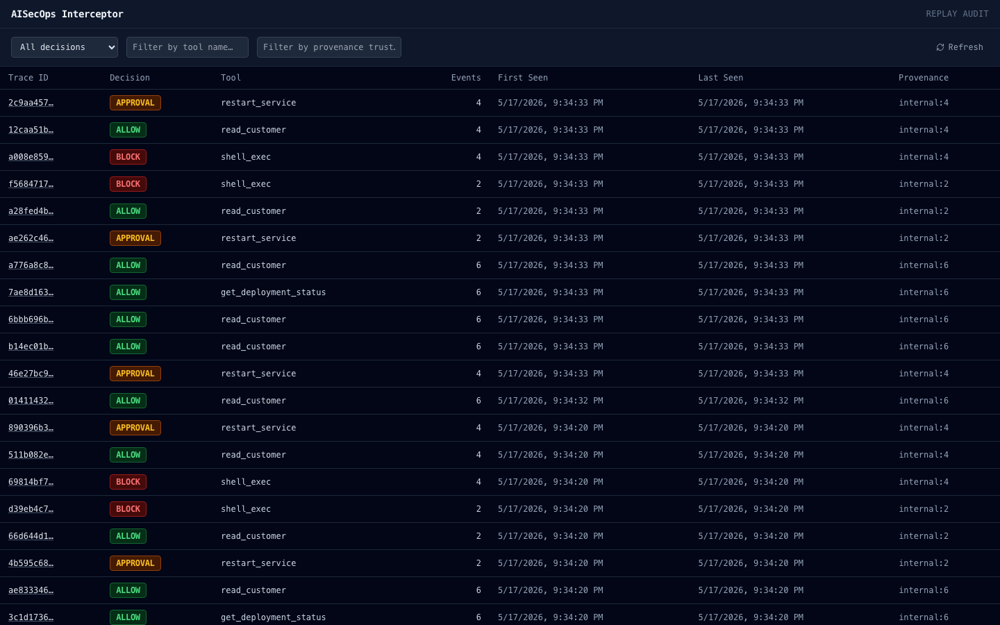
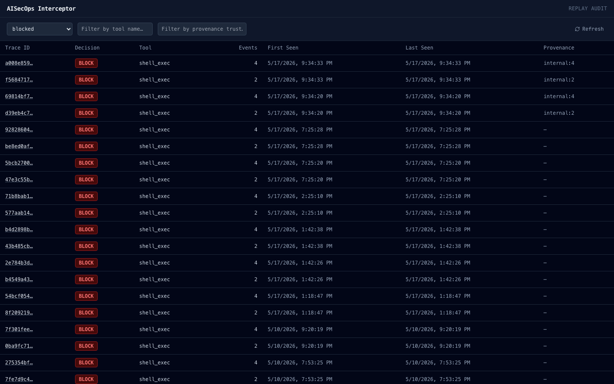
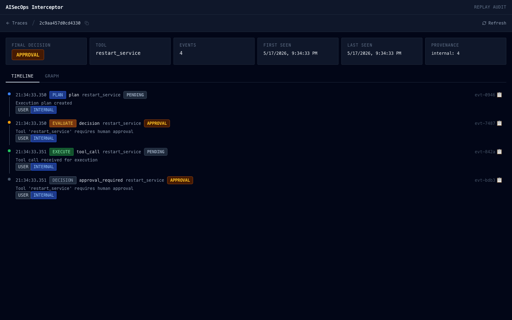
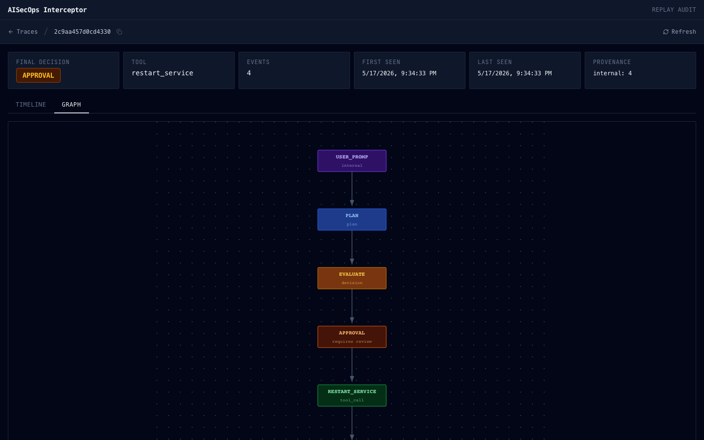
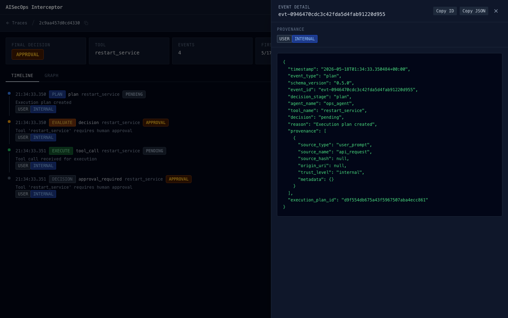

# AISecOps Interceptor — Runtime Governance Console

Read-only governance and forensic investigation console for AISecOps Interceptor v1.0.0.

Visualizes:
- agent activity
- provenance
- policy decisions
- runtime controls
- tool execution
- replay analysis
- governance outcomes

## Platform Scope

The dashboard is the visual investigation layer for the AISecOps Runtime Governance Platform.

Current capabilities:

- Replay investigation
- Audit trail analysis
- Provenance inspection
- Execution graph visualization
- Runtime governance review

Planned capabilities:

- Replay Diff Viewer
- Compliance Evidence Viewer
- Agent Identity Explorer
- MCP Activity Investigation
- Governance Reporting

---

## Screenshots

### Trace List


Browse all intercepted traces. Filter by decision, tool name, or provenance trust level.

### Trace List — Filtered


Filter by decision type (e.g. `blocked`) to narrow to specific outcome classes.

### Trace Detail — Timeline


Ordered event timeline showing decision stages, provenance badges, and inline metadata.
Hover any row to see the full metadata tooltip. Click to open the event drawer.

### Trace Detail — Execution Graph


SVG graph of the execution flow: provenance sources → plan → evaluate → [approval] → [tool] → outcome.
Node colors reflect stage type and final decision. Click any node to open its event drawer.

### Event Drawer


Full event detail: provenance section with trust badges, Copy ID / Copy JSON buttons, and raw JSON.

---

## Running locally

### Prerequisites

- Node.js 18+
- Python 3.11+ with the AISecOps Interceptor backend running

### Backend (FastAPI — port 8000)

```bash
# from repo root
uvicorn aisecops_interceptor.api.main:app --reload --port 8000
```

### Frontend (Vite — port 5173)

```bash
cd dashboard
cp .env.example .env        # only needed on first run
npm install
npm run dev
```

Open http://localhost:5173

---

## Environment variables

| Variable | Default | Description |
|---|---|---|
| `VITE_API_BASE_URL` | `http://localhost:8000` | Base URL of the FastAPI backend |

Set in `dashboard/.env`. The `.env.example` file contains the default values.

---

## Runtime Governance APIs

| Method | Path | Used by |
|---|---|---|
| `GET` | `/replay` | Trace list page |
| `GET` | `/replay/{trace_id}` | Trace detail — timeline and graph |
| `GET` | `/replay/{trace_id}/summary` | Trace detail — summary cards |
| `GET` | `/replay/{trace_id}/diff` | Replay diff and governance analysis |

No authentication. No write operations. All requests are read-only.

---

## UI screens

### Trace list (`/`)

- Displays all intercepted traces returned by `GET /replay`
- Filters: decision type, tool name, provenance trust (debounced 300ms)
- Columns: trace ID (truncated, links to detail), final decision badge, tool name, event count, first seen, last seen, provenance trust summary
- Empty state, loading state, and backend-unavailable error state are all handled

### Trace detail (`/trace/:traceId`)

Summary cards across the top: final decision, tool name, event count, first seen, last seen, provenance trust summary.

Two tabs:

**Timeline tab**
- Ordered list of events from `GET /replay/{trace_id}`
- Each event shows: timestamp (`HH:mm:ss.SSS`), decision stage badge, event type, tool name, decision badge, copyable event ID
- Provenance badges inline: source label (`USER` / `INTERNAL` / `SKILL` / etc.) paired with trust level (`trusted` / `internal` / `external` / `unverified`)
- Hover tooltip: full event ID, timestamp, decision, event type, provenance summary
- Click any event row → opens event drawer

**Graph tab**
- SVG execution graph built from the same event data
- Node layers: provenance sources → plan → evaluate → approval (if present) → tool (if present) → outcome
- Node and edge colors vary by stage type and decision outcome
- Click any node with a source event → opens event drawer
- Handles block, allow, approval, and dry_run trace shapes; graceful empty state if no events

Future investigation views:

- Replay Diff
- Compliance Evidence
- Agent Identity
- MCP Activity

### Event drawer

- Slides in from the right on event row or graph node click
- Provenance section: visual source + trust badge pairs
- Copy ID button (copies full `event_id`), Copy JSON button (copies full event as JSON)
- Raw event JSON in a monospace green-on-dark block
- Press `Escape` or click backdrop to close

---

## Component structure

```
src/
  api/
    replayClient.ts          — typed axios client; all backend calls and shared types
  components/
    DecisionBadge.tsx        — decision pill (allow / block / require_approval / pending / dry_run)
    DecisionStageBadge.tsx   — stage pill (plan / evaluate / execute / block / approval / dry_run)
    ProvenanceBadge.tsx      — abbreviated source + trust badge pairs (USER/SYS/SKILL/RAG/…)
    ProvenanceBadges.tsx     — full source name + trust badge pairs (alternate style)
    MetadataTooltip.tsx      — hover tooltip on timeline event rows
    TimelineEvent.tsx        — single event row with connector dot, badges, and tooltip
    ExecutionGraph.tsx       — SVG graph renderer (nodes, edges, arrowheads, dot grid)
    EventDrawer.tsx          — slide-in detail panel with provenance section and copy buttons
    SummaryCards.tsx         — summary card row (decision, tool, event count, timestamps, trust)
  lib/
    buildExecutionGraph.ts   — pure function: TraceEvent[] → GraphNode[] + GraphEdge[] + svgHeight
    clipboard.ts             — copyToClipboard with textarea fallback
  pages/
    TraceList.tsx            — trace list with debounced filters and table
    TraceDetail.tsx          — timeline + graph tabs, summary cards, drawer state
```

---

## Design

- Dark mode only (`slate-950` background)
- Terminal / security-console aesthetic
- Monospace (`JetBrains Mono`) throughout — IDs, badges, timestamps, JSON
- Compact density — forensic readability over visual decoration
- No gradients, no animations, no external charting libraries

---

## Build

```bash
cd dashboard
npm run build
```

Output in `dashboard/dist/`. No test suite currently configured.

---

## Runtime Governance Console Summary

- Trace list with decision / tool / provenance trust filters
- Timeline with color-coded decision stage badges (plan / evaluate / execute / approval)
- Provenance badges: source type + trust level inline on every event row
- Hover tooltip with full event metadata on timeline rows
- Execution graph (plain SVG): provenance → plan → evaluate → [approval] → [tool] → outcome
- Event drawer: provenance section, Copy ID, Copy JSON, raw JSON block
- Summary cards: final decision, tool, event count, first seen, last seen, trust summary
- Empty, loading, and error states on all pages
- Foundation for Replay Diff visualization
- Foundation for Compliance Evidence review
- Foundation for Agent Identity investigation
- Foundation for MCP governance workflows

---

## Platform Alignment

The dashboard supports the AISecOps Runtime Governance Platform vision:

Security
- Capability enforcement visibility
- Policy decision visibility

Compliance
- Audit investigation
- Evidence generation workflows

Cost Control
- Runtime budget visibility (future)

Observability
- Replay analysis
- Execution graphs
- Governance investigation
